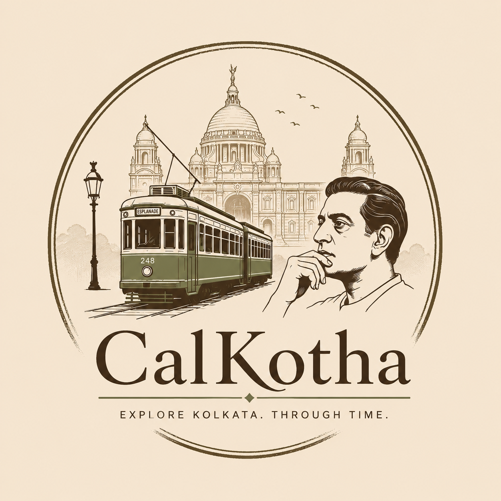

<div align="center">



# CalKotha — কলকাথা

### *Explore Kolkata. Through Time.*

[](.)
[](LICENSE)
[](.)
[](.)

**CalKotha** is an immersive, mobile-first heritage exploration platform for Kolkata — blending interactive maps, real historical narratives, GPS stamp collection, AR time travel, and an AI guide into a single progressive web app.

[Features](#features) · [Pages](#pages--navigation) · [Tech Stack](#tech-stack) · [Getting Started](#getting-started) · [Project Structure](#project-structure) · [Team](#team)

</div>

---

## What is CalKotha?

Kolkata is one of the world's most layered cities — every neighbourhood carries centuries of colonial, cultural, and revolutionary history that goes largely undiscovered by both visitors and locals alike. CalKotha turns that history into a living, interactive experience.

Users explore **70+ verified heritage sites**, collect **GPS-unlocked stamps**, read **45 curated heritage stories**, follow **18 thematic walking trails**, and consult an **AI-powered heritage guide** — all from a beautifully designed PWA that works on any phone or browser.

> *"Every street has a story. Every stone has a memory."*

---

## Features

### 🗺️ Interactive Heritage Map
Full Leaflet.js map with custom-styled markers for every heritage site across Kolkata. Filter by category (Colonial, Cultural, Religious, Revolutionary), search by name or neighbourhood, and get real road-following routes via OSRM. AI-generated route suggestions based on your mood, time budget, and interests.

### 📖 Heritage Stories
45 long-form narratives covering the people, events, and forgotten histories behind Kolkata's landmarks — from the founding of the Victoria Memorial to the revolutionary spirit of Jorasanko Thakurbari. Swipeable card stack UI with full story reader.

### 🏛️ Heritage Passport & GPS Stamps
Each user builds a personal Heritage Passport — a gamified travel log that fills with stamps as they physically visit locations. Stamps are GPS-verified on-device; no server required. XP system, level progression, and a collectible stamp album.

### 🤖 AI Heritage Guide
An in-app conversational AI guide (Claude-powered) that answers questions about Kolkata's history, recommends routes, explains architectural styles, and narrates the stories of any site on the map.

### 📷 AR Time Travel *(Prototype)*
Camera-based AR overlay that superimposes historical context on live views of heritage sites. Uses device GPS and compass to anchor historical annotations in real space.

### 🧭 Curated Heritage Trails
18 pre-built walking routes — Colonial Kolkata, North Kolkata by Tram, Revolutionary Footsteps, Literary Lanes, and more — each with estimated time, distance, and narrative context.

### ❤️ Favourites & Search
Save any location or story to a personal favourites list. Full-text search across all heritage sites, stories, and routes.

### ⚙️ Explorer Profile & Settings
Customisable profile with avatar, name, and notification preferences. All data stored locally — no account or login required.

---

## Pages & Navigation

| Page | Description |
|---|---|
| **Splash** | Animated entry screen with logo and Bengali subtitle |
| **Home** | Hero, featured locations, story stack, trails preview, stamp explainer, team |
| **Map** | Full interactive heritage map with filters, search, and AI route panel |
| **Heritage Detail** | Individual site view with history, architecture, and stamp unlock |
| **Stories** | Stack-card browser + full grid of all heritage narratives |
| **Story Reader** | Long-form article view with immersive header |
| **Passport** | Heritage passport card, XP/level display, stamp album |
| **Search** | Global search across all content |
| **Favourites** | Saved locations and stories |
| **AI Guide** | Conversational heritage assistant |
| **AR Mode** | Camera + live heritage overlay *(prototype)* |
| **Settings** | Profile, notifications, GPS, data preferences |
| **Contact** | Message form for contributions and feedback |

Navigation is handled by a fixed bottom dock with 8 icon tabs, a floating glass back button, and an AI Guide FAB.

---

## Tech Stack

CalKotha is a **zero-dependency PWA** — no build tools, no frameworks, no backend required.

| Layer | Technology |
|---|---|
| Structure | Vanilla HTML5 |
| Styling | Vanilla CSS3 — custom properties, grid, flex, animations |
| Logic | Vanilla JavaScript (ES6+) |
| Maps | [Leaflet.js](https://leafletjs.com/) v1.9.4 |
| Routing | [OSRM](http://project-osrm.org/) (open road-following routes) |
| Icons | [Font Awesome](https://fontawesome.com/) 6.5 |
| AI Guide | [Anthropic Claude](https://anthropic.com/) API (claude-sonnet-4) |
| Storage | `localStorage` — fully offline, no account needed |
| Hosting | Any static host (GitHub Pages, Netlify, Vercel) |

---

## Getting Started

### Prerequisites
- Any modern browser (Chrome, Firefox, Safari, Edge)
- A local web server for GPS features (e.g. VS Code Live Server, Python's `http.server`)
- An Anthropic API key for the AI Guide feature

### Run Locally

```bash
# Clone the repository
git clone https://github.com/YOUR_USERNAME/CalKotha.git
cd CalKotha

# Serve with Python (or any static server)
python -m http.server 8080

# Open in browser
# http://localhost:8080
```

### AI Guide Setup

The AI Guide requires an Anthropic API key. Open `script.js` and set your key in the AI config section:

```js
const ANTHROPIC_API_KEY = 'sk-ant-...';
```

> ⚠️ **Note:** For production, never expose your API key in client-side code. Use a lightweight proxy server or serverless function to relay requests.

### Deploy to GitHub Pages

```bash
# In repository settings → Pages → Source: Deploy from branch → main / (root)
# Your site will be live at: https://YOUR_USERNAME.github.io/CalKotha
```

---

## Project Structure

```
CalKotha/
├── index.html          # Single-page app — all pages, sections, and content
├── style.css           # All styles — design system, components, animations
├── script.js           # All logic — maps, navigation, AI, stamps, stories
├── manifest.json       # PWA manifest
└── assets/
    ├── logo.png         # CalKotha brand logo
    ├── tuhin.png        # Team photo — Tuhin Biswas
    ├── priyanshu.png    # Team photo — Priyanshu Saha
    └── ...              # Heritage site imagery
```

Everything lives in three files — `index.html`, `style.css`, and `script.js` — making the project trivially easy to host, fork, and extend.

---

## Heritage Data

All heritage site data — names, descriptions, coordinates, year of establishment, architectural style, and historical narratives — is **real and manually verified** from primary sources including the Archaeological Survey of India, Kolkata Municipal Corporation records, and academic historical texts.

Current dataset includes:
- **70+ heritage locations** across all major Kolkata neighbourhoods
- **45 long-form stories** covering colonial, cultural, religious, and revolutionary history
- **18 curated walking routes** spanning North Kolkata, Central Kolkata, Howrah, and beyond
- **12 hidden gems** — lesser-known sites outside the typical tourist trail

---

## Roadmap

- [ ] Native mobile app (React Native / Capacitor)
- [ ] Community story contributions with moderation
- [ ] Offline-first map tiles for areas with poor connectivity
- [ ] Multilingual support — Bengali, Hindi, English
- [ ] AR marker recognition for automatic site detection
- [ ] Social passport sharing — compare stamps with friends
- [ ] Event calendar — heritage walks, cultural festivals
- [ ] School programme integration

---

## Team

<table>
<tr>
<td align="center" width="50%">
<br>
<strong>Tuhin Biswas</strong><br>
<sub>Founder · UI/UX · Frontend</sub><br>
<sub><a href="https://github.com/tuhin_biswas">@tuhin_biswas</a></sub>
</td>
<td align="center" width="50%">
<br>
<strong>Priyanshu Saha</strong><br>
<sub>DB · Backend · APIs</sub><br>
<sub><a href="https://github.com/priyanshu_saha">@priyanshu_saha</a></sub>
</td>
</tr>
</table>

---

## Contributing

CalKotha is currently a closed developer preview. Contributions to the heritage dataset, story writing, and bug reports are welcome — please open an issue or reach out via the in-app contact form.

---

## License

MIT License — see [LICENSE](LICENSE) for details.

---

<div align="center">

Built with ❤️ in Kolkata · কলকাতায় তৈরি

*Preserving the stories of a city that never forgets.*

</div>
